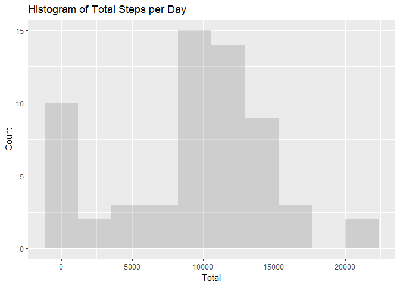
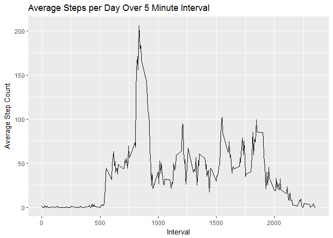
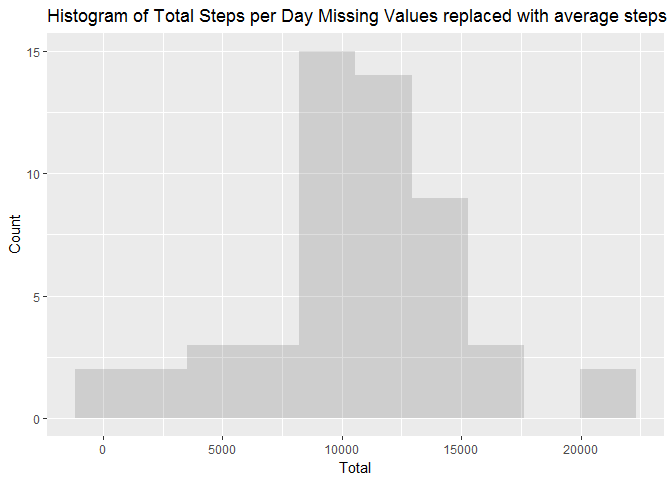
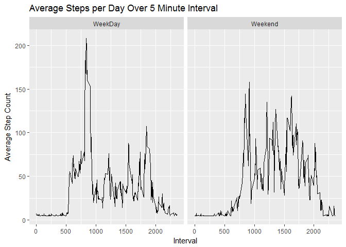

# Reproducible Research: Peer Assessment 1
Ann Crawford  
April 7, 2017  


## Loading and preprocessing the data


1. Load the data (i.e. read.csv())

2. Process/transform the data (if necessary) into a format suitable for your
analysis, eg make date a date type


```r
##install.packages("ggplot2")
##install.packages("dplyr")

rm(list = ls())
library(ggplot2)
library(plyr)

activityraw <-  read.csv("./data/activity.csv")
activity <- activityraw
activity$date <- as.Date(activity$date, format="%Y-%m-%d")
```
##What is the mean total number of steps taken per day?

1. Make a histogram of the total number of steps taken each day

2. Calculate and report the mean and median total number of steps taken
per day


```r
###stepst<- aggregate(steps ~ date,  data= activity, sum,  na.rm=TRUE)
stepst <-ddply(activity, c("date"), summarize,  totalsteps = sum(steps,na.rm=TRUE) ) 

meanstepsPerDay   <- mean(stepst$totalsteps, na.rm = TRUE)
medianstepsPerDay <- median(stepst$totalsteps, na.rm = TRUE)
```

```r
ggplot(data=stepst, aes(stepst$totalsteps)) + 
  geom_histogram(bins = 10 ,
                 alpha = .2) + 
  labs(title="Histogram of Total Steps per Day") +
  labs(x="Total", y="Count") 
```

<!-- -->

**The average steps per day is 9354.23 .**

**The median steps per day is 10395.**


## What is the average daily activity pattern?

1. Make a time series plot (i.e. type = "l") of the 5-minute interval (x-axis)
and the average number of steps taken, averaged across all days (y-axis)

2. Which 5-minute interval, on average across all the days in the dataset,
contains the maximum number of steps?


```r
avgint <- aggregate(steps ~ interval,  data= activity, mean,  na.rm=TRUE)
maxsteps <- subset(avgint,steps == max(avgint$steps) )

 ggplot(avgint, aes(x=interval,y=steps)) + 
  geom_line() +
  labs(title="Average Steps per Day Over 5 Minute Interval") +
  labs(x="Interval", y="Average Step Count") 
```

<!-- -->

**The most steps on average are taken in interval 835.**

## Imputing missing values

1. Calculate and report the total number of missing values in the dataset
(i.e. the total number of rows with NAs)

2. Devise a strategy for filling in all of the missing values in the dataset. The
strategy does not need to be sophisticated. For example, I used a single mean to fill in. 

3. Create a new dataset that is equal to the original dataset but with the
missing data filled in.

4. Make a histogram of the total number of steps taken each day and Calculate
and report the mean and median total number of steps taken per day. Do
these values differ from the estimates from the first part of the assignment?

What is the impact of imputing missing data on the estimates of the total
daily number of steps?
Are there differences in activity patterns?


```r
Totalmissing <- sum(is.na(activityraw$date)) +sum(is.na(activityraw$interval)) + sum(is.na(activityraw$steps))

NoNa = transform(activity, steps = ifelse(is.na(steps), mean(steps, na.rm=TRUE), steps))

Total2<- aggregate(steps ~ date,  data= activity, sum,  na.rm=TRUE)

meanstepsPerDay2 <- format(mean(Total2$steps), scientific = FALSE)
medianstepsPerDay2 <- median(Total2$steps)

phist2 <- ggplot(data=Total2, aes(Total2$steps)) + 
  geom_histogram(bins = 10 ,
                 alpha = .2) + 
  labs(title="Histogram of Total Steps per Day Missing Values replaced with average steps") +
  labs(x="Total", y="Count") 
phist2
```

<!-- -->

**Raw data has 2304 missing values.**

**The average steps per day after removing NA's is 10766.19  .**

**The median steps per day is per day after removing NA's 10765 .**

**Imputing the missing values changed the mean and median slightly but did not alter the pattern.** 

##Are there differences in activity patterns between weekdays and weekends?

1. Create a new factor variable in the dataset with two levels – “weekday”
and “weekend” indicating whether a given date is a weekday or weekend
day.

2. Make a panel plot containing a time series plot (i.e. type = "l") of the
5-minute interval (x-axis) and the average number of steps taken, averaged
across all weekday days or weekend days (y-axis). 


```r
NoNa$WEorWD = ifelse( weekdays(NoNa$date) == "Saturday"  | weekdays(NoNa$date) == "Sunday" , "Weekend", "WeekDay")

avgwd <-ddply(NoNa, c("interval", "WEorWD"), summarize,  meanst = mean(steps,na.rm=TRUE) ) 

qplot( interval,meanst, data = avgwd, geom = "line", 
  main="Average Steps per Day Over 5 Minute Interval" ,
  xlab="Interval", ylab="Average Step Count" ,
  facets =  .~WEorWD )
```

<!-- -->

**Most steps are taken in during the weekdays in the early hours.  Weekends see later and less steps.**
